# Wireshark Network Forensics: Analyzing Plaintext Vulnerabilities and Executing TLS Decryption

## Project Overview
This project focuses on identifying network security weaknesses across the application and transport layers using Wireshark. The lab is split into two distinct phases. Phase 1 demonstrates the extreme security risks associated with legacy, unencrypted HTTP communication by capturing a live administrative credential payload. Phase 2 walks through an advanced forensic workflow, demonstrating how a security analyst can decrypt traffic hidden inside an encrypted TLS session using a pre-shared server private key.

## Lab Environment and Sourcing
The packet capture files and cryptographic assets used to conduct this lab were obtained from a public educational repository created for a DEF CON packet hunting workshop. 

* **Source Repository:** [packetrat/packethunting](https://github.com/packetrat/packethunting)
* **Target Artifacts:** `HTTP-password.pcap`, `SSL-decryption.pcap`, and `server.pem`

---

## Phase 1: Cleartext Credential Extraction over HTTP

### 1. Sourcing the PCAP Artifact
To isolate plaintext data transmission, the initial step required downloading the targeted unencrypted network sample from the open source workshop repository.

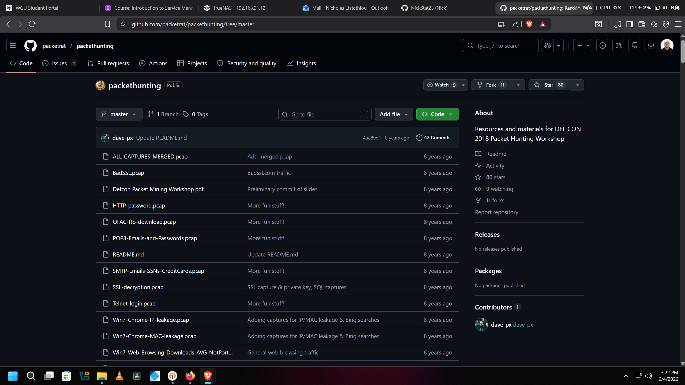

The targeted file, `HTTP-password.pcap`, was saved locally into a dedicated lab directory for analysis.

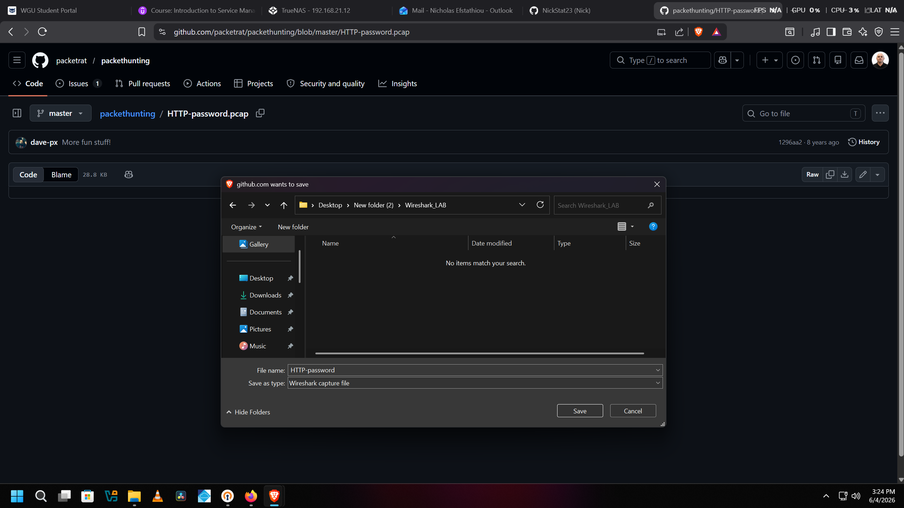

### 2. Identifying the Vulnerable Session
Upon opening `HTTP-password.pcap` in Wireshark, the packet list window initially populated with a high volume of TCP handshake and background network traffic. 

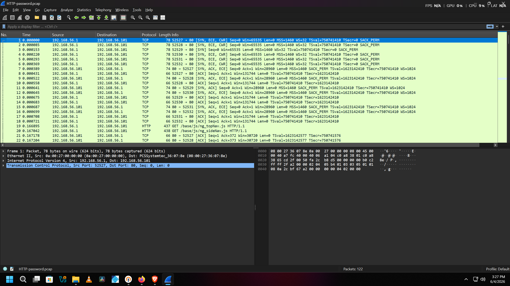

Applying the `http` display filter isolated the relevant application layer conversations. Packet 70 stood out immediately as a high value target, showing an outbound HTTP `POST` request directed to an administrative login page.

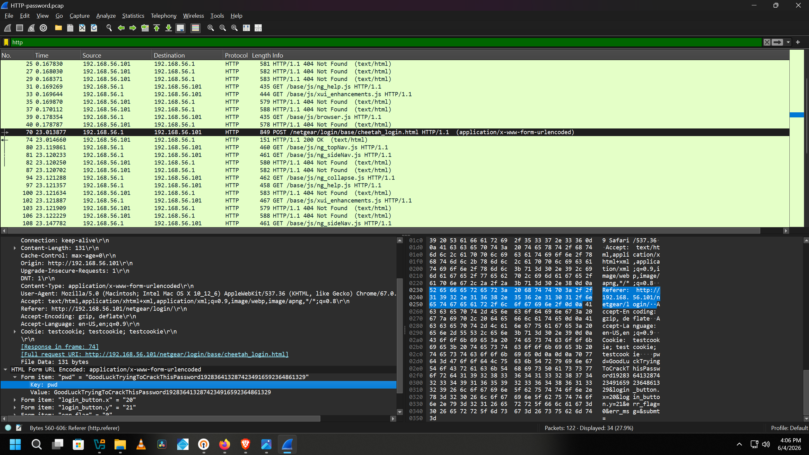

### 3. Reconstructing the Cleartext Conversation
To read the full data payload, I right clicked on Packet 70 and selected **Follow > HTTP Stream**. This allowed me to pivot away from individual packet fragments and look at the entire raw conversation as a unified script.

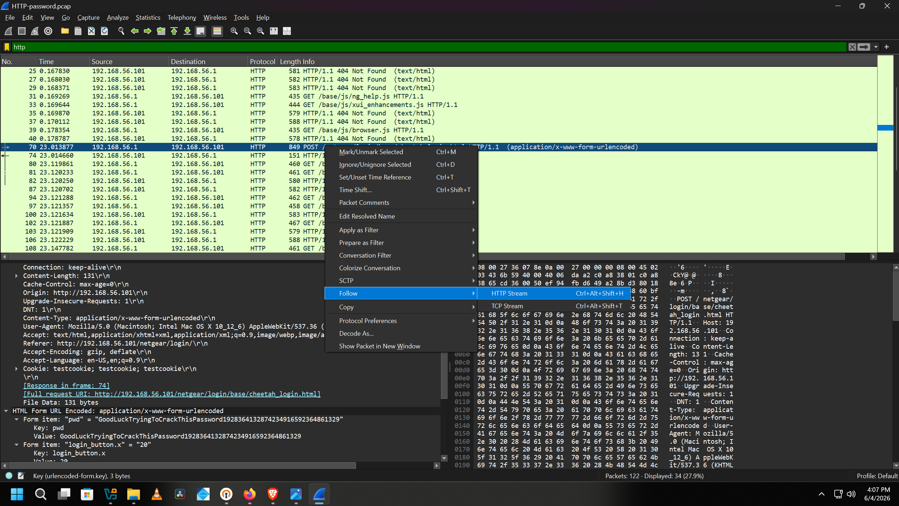

### 4. Forensic Extraction of Evidence
Because the application relied on standard HTTP instead of an encrypted protocol, the entire payload was exposed. Inside the stream window, the client browser parameters and backend server configurations were completely visible in plain text.

* **Source Client IP:** 192.168.56.1
* **Destination Host IP:** 192.168.56.101
* **Target Path:** `/netgear/login/base/cheetah_login.html`
* **Compromised Administrative Password:** `pwd=GoodLuckTryingToCrackThisPassword1928364132874234916592364861329`

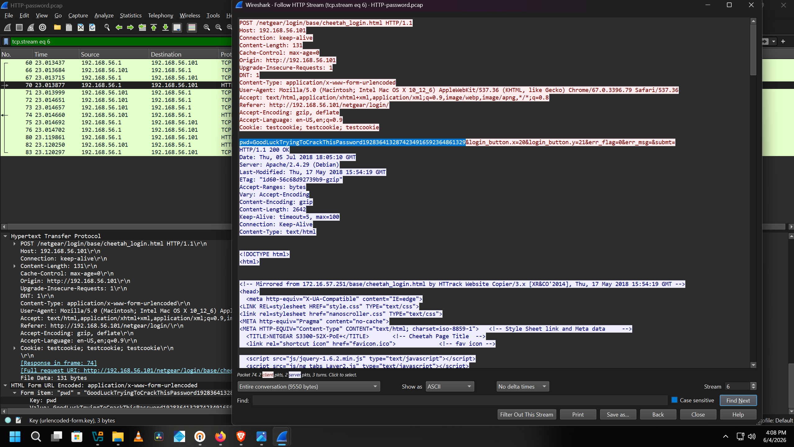

> **Phase 1 Takeaway:** Even though the user created a highly complex, 63 character password, the lack of transport layer security rendered the complexity useless. Any observer on the routing path could extract the key immediately because the payload lacked encryption.

---

## Phase 2: Advanced Network Forensics and TLS Session Decryption

### 1. The Encryption Obstacle
For the second phase of the lab, I downloaded `SSL-decryption.pcap` from the repository to analyze secure traffic behaviors.

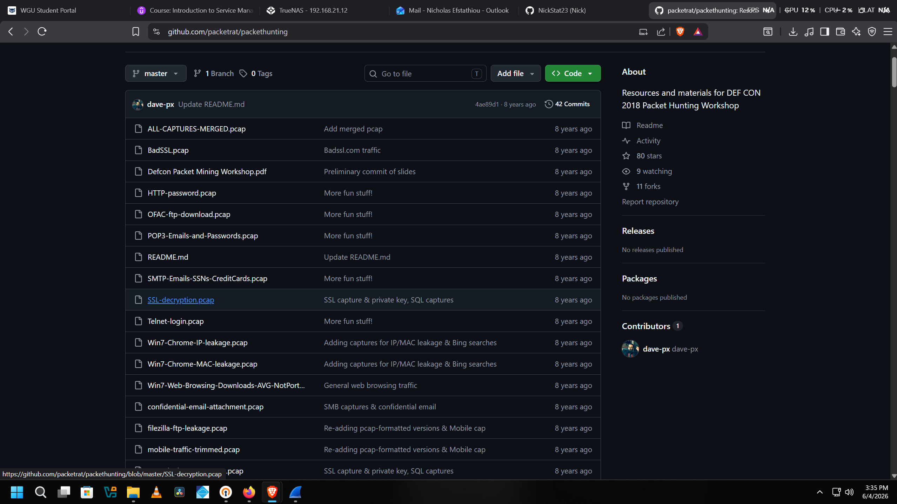

When opening `SSL-decryption.pcap`, the application layer data was completely hidden. Because the session successfully negotiated a secure TLS v1.2 tunnel, Wireshark could only display the encrypted records. Attempting to follow the TLS stream at this point resulted in a completely blank window because the raw binary payload was mathematically unreadable.

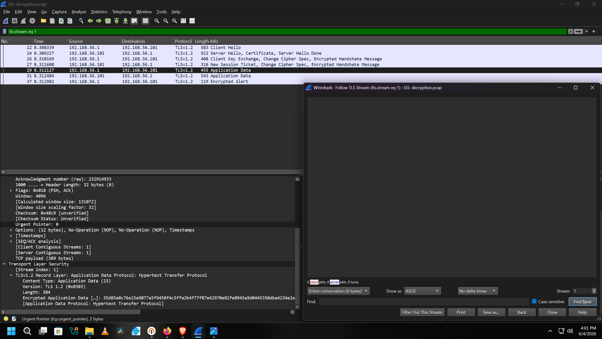

### 2. Sourcing and Injecting the Private Key File
To break the encryption layer post-incident, I accessed the server's pre-shared private key block (`server.pem`) hosted within the workshop repository files.

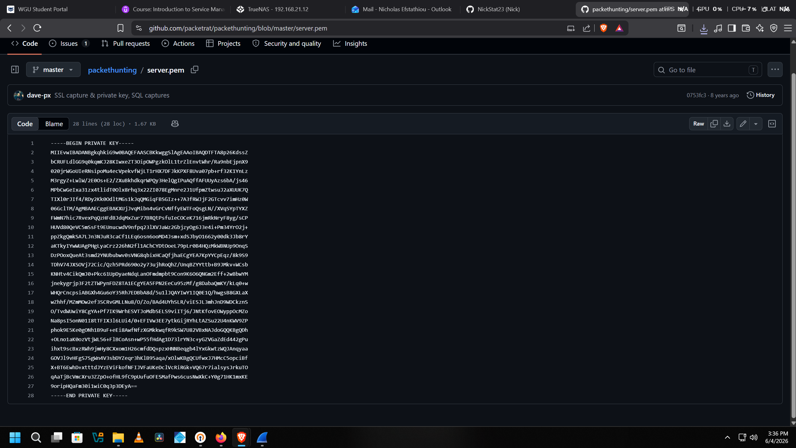

I opened Wireshark's configuration settings by navigating to **Edit > Preferences > Protocols > TLS**. Inside the **RSA keys list** menu, I added a new cryptographic entry mapping port 443 to the local path of the `server.pem` file.

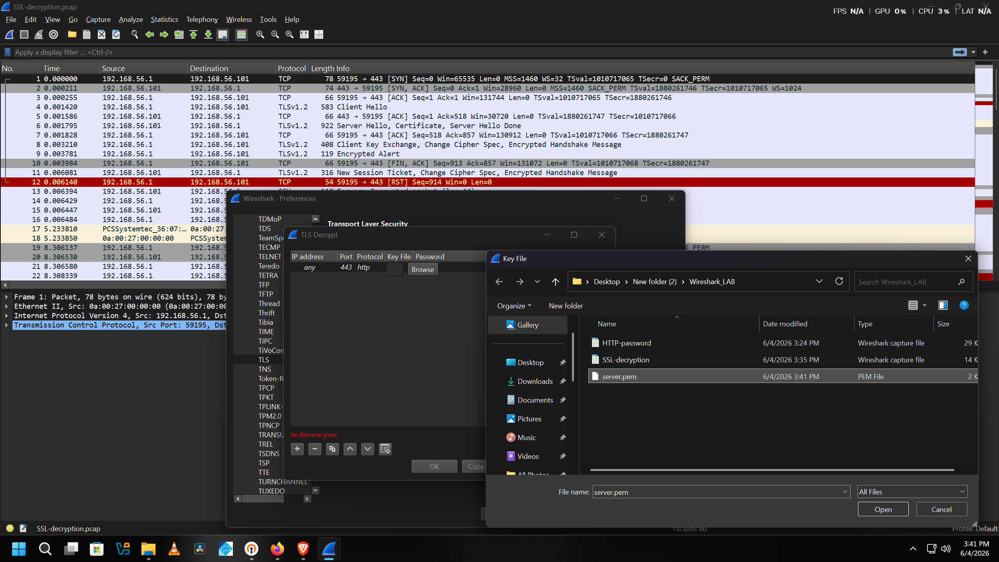

Once the paths were mapped and applied, Wireshark saved the global configuration rule, allowing it to automatically attempt background decryption on any packets matching that specific key structure.

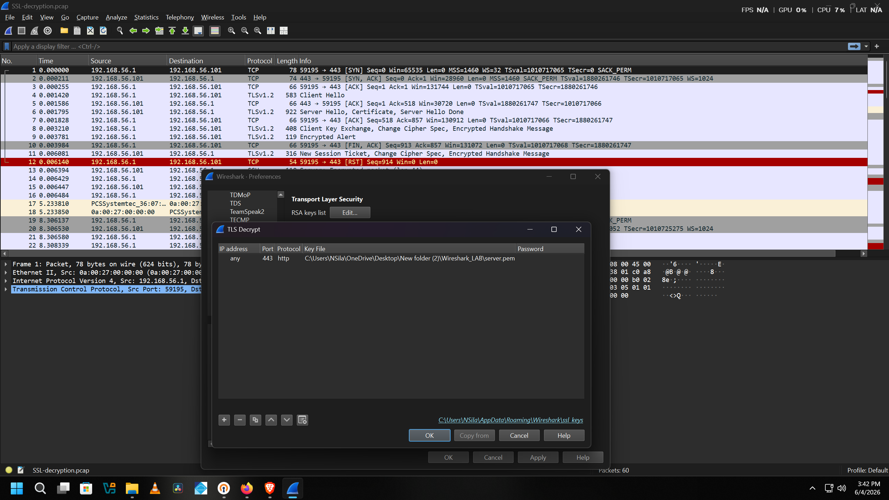

### 3. Cryptographic Recomputation and Successful Decryption
The moment the private key was applied, Wireshark re-evaluated the capture file using the RSA variables. The generic `TLSv1.2` application data records successfully decrypted, exposing a brand new layer of plaintext `HTTP` protocol packets.

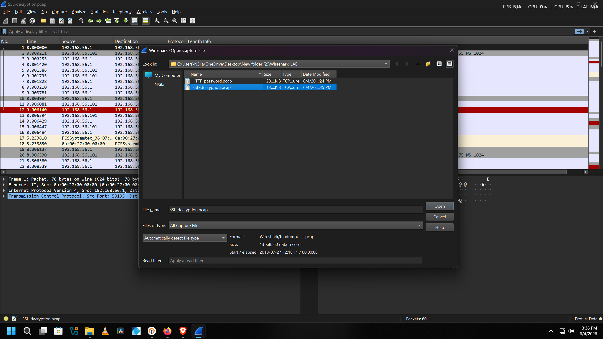

Running a display filter for `http` brought up Packet 29. Right clicking the packet and selecting **Follow > HTTP Stream** opened up the plaintext contents of the previously hidden conversation.

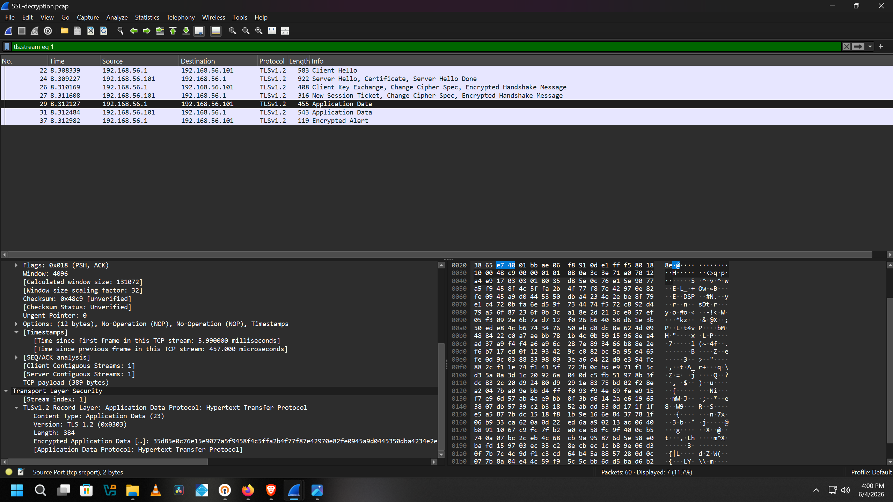

### 4. Technical Analysis of the Decrypted Stream
The decrypted stream revealed that the target server was running an OpenSSL testing daemon rather than a standard web interface. The session exposed critical cryptographic metadata:

* **Target Daemon Process:** `s_server -www -cipher AES256-SHA -key server.pem -cert server.crt -accept 443`
* **Negotiated Protocol Standard:** TLS v1.2
* **Enforced Symmetric Cipher Suite:** AES256-SHA
* **Exposed Session Master Key:** `A0EFF65B633854E386FADA958A8B14B5353E06C3EC6BD55345B363DC1E9777343438175D7949D59409EA884BAF55DAFA`

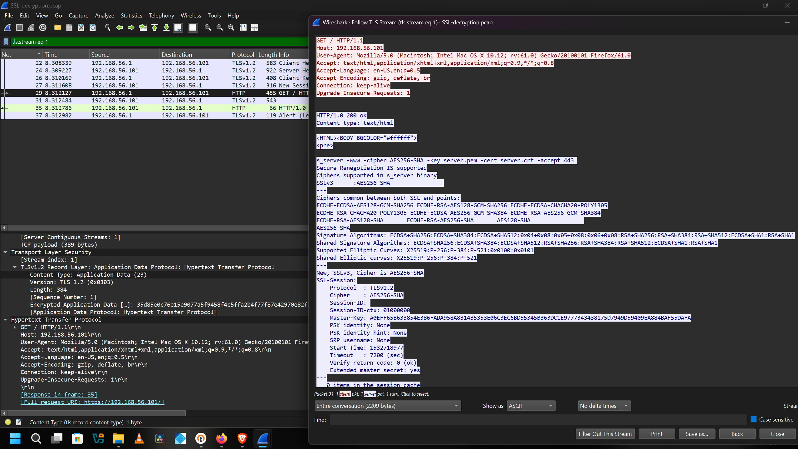

> **Phase 2 Takeaway:** This phase proves the critical importance of Private Key Infrastructure defense. If a server private key is leaked or stolen, an auditor or threat actor can completely bypass transport security controls, reverse the asymmetric handshake, and extract the session master keys to view all past and present traffic in cleartext.

---

## Defense and Mitigation Recommendations
1. **Mandate Modern Transport Encryption:** Completely deprecate legacy cleartext HTTP, Telnet, and FTP configurations across the corporate infrastructure, enforcing TLS v1.3 as the baseline standard for all web assets.
2. **Implement HTTP Strict Transport Security (HSTS):** Enforce hardcoded HSTS headers on all public and internal web servers. This forces client browsers to establish an HTTPS connection natively, completely neutralizing Man in the Middle downgrade attempts before data is sent.
3. **Isolate and Rotate Cryptographic Keys:** Restrict host level access to server `.pem` private keys using strict role based access controls, and implement routine key rotation schedules to minimize the retroactive blast radius if a private key is ever exposed.

---

## Disclaimer
This project is created strictly for academic research, portfolio documentation, and educational purposes as part of a cybersecurity curriculum. All packet captures and analysis activities were performed within an isolated lab environment using publicly available, non-production training files.
