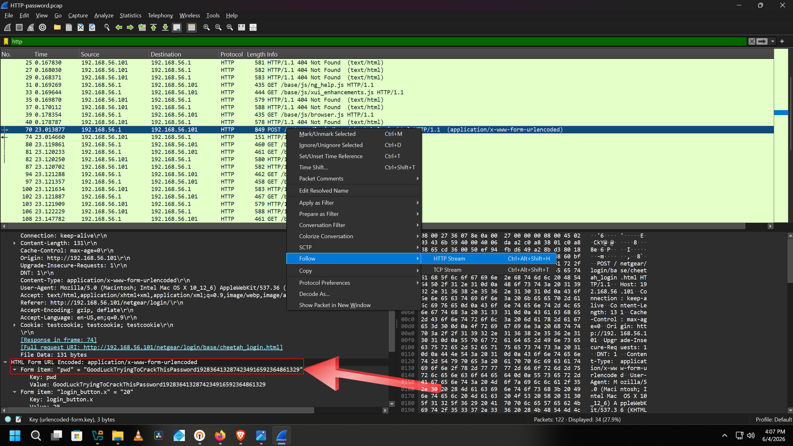
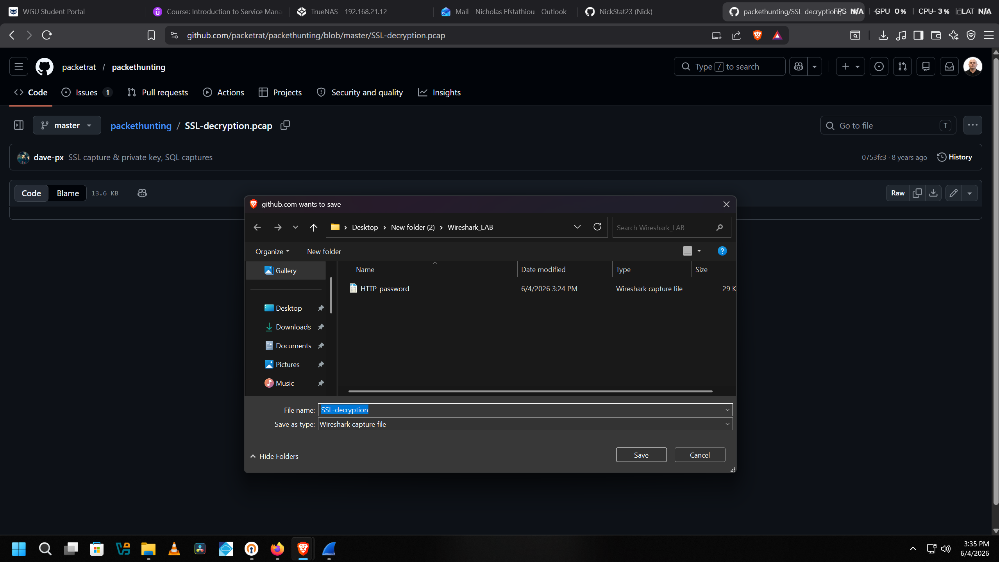

# Wireshark Network Forensics: Plaintext Vulnerabilities & TLS Decryption

## Project Overview
This project uses Wireshark to dig into two real network security scenarios that come up constantly in blue team and forensics work. Phase 1 is pretty eye-opening; it shows how easy it is to pull credentials straight out of unencrypted HTTP traffic. Phase 2 goes deeper into TLS decryption, walking through how an analyst can use a leaked server private key to completely unwrap an "encrypted" session after the fact.

Both phases used publicly available packet captures from a DEF CON packet hunting workshop, so everything here is legal and educational.

* **Source Repository:** [packetrat/packethunting](https://github.com/packetrat/packethunting)
* **Files Used:** `HTTP-password.pcap`, `SSL-decryption.pcap`, `server.pem`

---

## Phase 1: Pulling Credentials Out of Plain HTTP Traffic

### Downloading the Capture
First step was grabbing the targeted pcap from the workshop repo and saving it locally.

### Opening the Capture in Wireshark
When I first opened `HTTP-password.pcap`, the packet list was full of TCP handshakes and background noise. Nothing unusual at first glance.

Filtering by `http` cleaned things up fast. Packet 70 jumped out right away, a POST request hitting an admin login page.

### Following the HTTP Stream
Right-clicking Packet 70 and selecting **Follow > HTTP Stream** let me read the entire conversation as one clean block instead of jumping between individual packets.

### What I Found
Since the site was running plain HTTP with zero encryption, everything in the payload was sitting right there in cleartext:

* **Client IP:** 192.168.56.1
* **Server IP:** 192.168.56.101
* **Login Page:** `/netgear/login/base/cheetah_login.html`
* **Exposed Password:** `pwd=GoodLuckTryingToCrackThisPassword1928364132874234916592364861329`

> **Takeaway:** The user had a 63-character password. Didn't matter at all. Without TLS, anyone on the network path can read the payload like a text file. Password complexity is useless if the transport layer isn't encrypted.

---

## Phase 2: Decrypting a TLS Session with a Leaked Private Key

### The Problem: Everything is Encrypted
For this phase I loaded `SSL-decryption.pcap`. 

When I first opened this pcap, all application traffic was hidden inside secure protocols.

The session had successfully negotiated TLS 1.2, so Wireshark was only showing encrypted records. Following the TLS stream gave me nothing, just binary garbage.

### Loading the Private Key
The workshop repo also included `server.pem`, the server's private key. In a real incident this would be the scenario where an attacker got hold of the key through a breach or misconfiguration.

I went to **Edit > Preferences > Protocols > TLS** and added the key to the RSA keys list, mapping it to port 443.

### The Decryption
Once the key was loaded, Wireshark re-evaluated the whole capture. The TLS records flipped over to readable HTTP packets instantly.

Filtering for `http` and following the stream on Packet 29 revealed everything.

### What the Decrypted Traffic Showed
The server was running an OpenSSL test daemon. The decrypted stream exposed:

* **Server Process:** `s_server -www -cipher AES256-SHA -key server.pem -cert server.crt -accept 443`
* **TLS Version:** TLS 1.2
* **Cipher Suite:** AES256-SHA
* **Session Master Key:** `A0EFF65B633854E386FADA958A8B14B5353E06C3EC6BD55345B363DC1E9777343438175D7949D59409EA884BAF55DAFA`

> **Takeaway:** This is why private key security matters so much. If that key gets out, it doesn't matter how strong your encryption is; the whole session can be unwrapped retroactively. Forward secrecy (like ECDHE cipher suites) exists specifically to prevent this, since each session generates its own ephemeral keys that aren't stored anywhere.

---

## Recommendations

1. **Kill cleartext protocols:** HTTP, Telnet, FTP should not exist on any production infrastructure. TLS 1.3 minimum across the board.
2. **Enforce HSTS:** Adding HTTP Strict Transport Security headers forces browsers to always connect over HTTPS, blocking any downgrade attempts before the request even goes out.
3. **Protect and rotate private keys:** Restrict access to `.pem` files with strict permissions, audit who touches them, and rotate on a schedule. A leaked key compromises every past session that wasn't using forward secrecy.
4. **Use forward secrecy cipher suites:** ECDHE-based ciphers mean even if the private key leaks later, past sessions can't be decrypted. This phase demonstrated exactly why that matters.

---

## Disclaimer
All analysis was performed using publicly available, non-production training files from an open educational repository. This project is for academic and portfolio purposes only.

---

## 🙋 Author

**Nick Efstathiou,** Cybersecurity | Network Engineering | Home Lab  
[LinkedIn](https://www.linkedin.com/in/NickStat23)
